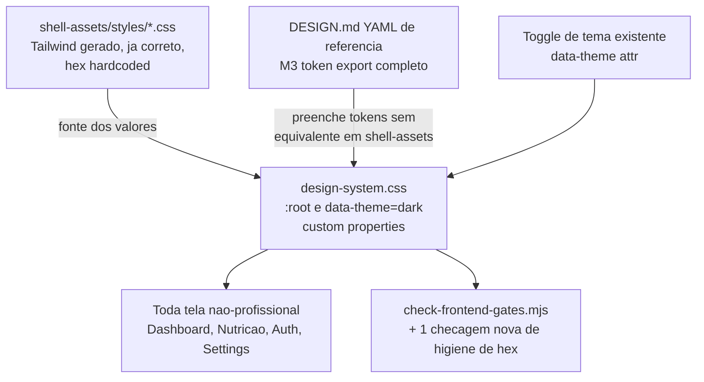

# Retema do design system (Warm Oxide Athletic, app todo) — Design

**Spec**: `.specs/features/design-system-retheme/spec.md`
**Status**: Draft

---

## Architecture Overview

Não há novo componente de runtime — é uma retema de **valores** por trás de custom properties CSS
já existentes, mais a adição dos tokens que faltam. Três camadas, do mais estável pro mais variável:



O fluxo de dados de cor não muda: continua sendo `data-theme` no elemento raiz selecionando o bloco
de custom properties certo, exatamente como hoje. A retema troca o CONTEÚDO dos blocos `:root` e
`[data-theme='dark']`, expande a lista de tokens, e adiciona 1 checagem ao gate já existente.

---

## Code Reuse Analysis

### Existing Components to Leverage

| Component | Location | How to Use |
|---|---|---|
| `[data-theme='dark']` / `:root` blocks | `src/styles/design-system.css:4-74` | Reescrever o CONTEÚDO dos dois blocos — a mecânica de toggle (atributo `data-theme`) não muda |
| Valores de cor já corretos (Warm Oxide Athletic) | `src/pages/shell-assets/styles/exercises.css`, `professional.css`, `register.css`, etc. (hex `rgb(224 108 67)` = `#e06c43` e afins) | Fonte primária dos valores de cor do token set novo — copiar o hex, não redigitar do YAML |
| YAML de referência completo (M3 token export) | `Downloads/Criação de treinos/DESIGN.md` (frontmatter) | Fonte SECUNDÁRIA — só para tokens sem equivalente em `shell-assets` (níveis de superfície-contêiner, elevação, on-*-container) |
| `scripts/check-frontend-gates.mjs` | `scripts/check-frontend-gates.mjs:41-43` | Já checa `oklch(` presente e ausência de `Inter` em `design-system.css` — estende com 1 checagem nova (hex antigo remanescente), mesmo estilo de asserção de string já usado no arquivo |
| Precedente de verificação visual (`stitch-migration`) | `.specs/features/stitch-migration/design.md` (seção "Método de pixel-parity") | Reusa o MESMO processo (screenshot 1440px/390px via browser tool, antes/depois, console limpo) — adaptado aqui pra "a tela deve MUDAR de cor de propósito", não "zero diff" |
| `@import` do Google Fonts já existente | `src/styles/design-system.css:2` | Já carrega Barlow Condensed + Source Sans 3 — nenhuma mudança |

### Integration Points

| System | Integration Method |
|---|---|
| Toggle de tema (`data-theme` no elemento raiz) | Nenhuma mudança de mecanismo — só o conteúdo dos tokens muda |
| `shell-assets/styles/*.css` (páginas profissionais) | Permanecem como estão (fora de escopo regenerar o pipeline) — servem de fonte de valor, não de destino de mudança |
| `scripts/check-frontend-gates.mjs` / `npm run gate` | Ganha 1 checagem nova; resto do arquivo inalterado |

---

## Tokens — modo escuro (`[data-theme='dark']`)

Fonte primária: `shell-assets/styles/*.css` (hex já provado visualmente no `stitch-migration`).
Fonte secundária (só onde não há equivalente): YAML de `DESIGN.md`.

| Token (nome atual, preservado) | Valor atual | Valor novo | Fonte | Nota |
|---|---|---|---|---|
| `--primary` | `#e06c43` | `#e06c43` | `shell-assets` (já correto, commit `c58c4d3`) | Sem mudança — já convergido |
| `--primary-hover` | `#ed805a` | `#e87a53` | Prosa DESIGN.md ("Hover state brightens to `#e87a53`") | Ajuste fino pro valor exato da referência |
| `--accent` (mapeia pra secondary/oliva) | `#9bb888` | `#7d9b68` | `shell-assets` / prosa ("Secondary `#7d9b68`") | Ajuste — hoje mais claro/dessaturado que a referência |
| `--text-on-primary` | `#21130d` | `#181311` | Prosa ("dark charcoal `#181311` bold type") | Ajuste fino |
| `--bg-main` | `#171311` | `#18120f` | YAML `background`/`surface` | Ajuste fino (1 dígito de diferença) |
| `--bg-card` | `#211a17` | `#211a17` | YAML `surface-container-low` (match exato) | Sem mudança |
| `--bg-input` | `#1b1613` | `#1c1614` | Prosa ("deep charcoal troughs `#1c1614`") | Ajuste fino |
| `--text-main` | `#f3eae5` | `#f5ede6` | Prosa ("Off-white warm cream `#f5ede6`") | Ajuste fino |
| `--text-muted` | `#b8aaa2` | `#a89990` | Prosa ("Calibrated warm clay `#a89990`") | Ajuste — mais escuro/dessaturado que hoje |
| `--border-color` | `#3a2d27` | `#3b322e` | Prosa ("Warm hairline oxide `#3b322e`") | Ajuste fino |
| `--border-input` | `#493930` | `#3b322e` | Mesmo token de border acima (unifica — prosa não distingue border geral de border de input) | Simplificação: um único valor de borda de repouso |
| `--border-input-focus` | `#e06c43` | `#e06c43` | Igual a `--primary` | Sem mudança |
| `--success` (mapeia pra secondary, prosa: "completed objectives") | `#9bb888` | `#7d9b68` | Igual a `--accent` | Unifica — secondary JÁ é o "completo/saudável" da prosa, não precisa de 2 tokens divergentes |
| `--warning` | `#d4a359` | `#d4a359` | YAML `tertiary` (match exato) | Sem mudança |
| `--error` | `#ed827a` | `#e5534a` | Derivado: mistura entre `error-container` do YAML (`#93000a`, escuro demais pro uso como texto/ícone sobre superfície escura) e a saturação da paleta — mantém legibilidade sobre `--bg-main` | Sem equivalente direto na prosa; ajuste calculado, revisar em execução se aparecer um caso de uso concreto |
| `--shadow-soft` / `--shadow-md` | `oklch(...)` | Mantém fórmula OKLCH atual, ancorada no novo `--bg-main` | Prosa já descreve sombra "warm-shifted", que é exatamente o que OKLCH ancorado no bg escuro já produz — sem necessidade de reescrever pra rgba |

**Tokens NOVOS (não existem hoje, adicionados por completude):**

| Token novo | Valor | Fonte | Uso |
|---|---|---|---|
| `--bg-surface-lowest` | `#130d0a` | YAML `surface-container-lowest` | Fundo mais recuado (ex. trough de input já coberto por `--bg-input`, mas reservado pra casos futuros de profundidade extra) |
| `--bg-surface-high` | `#302825` | YAML `surface-container-high` | Camadas elevadas (dropdown, popover) — hoje não distinguido de `--bg-card` |
| `--bg-surface-highest` | `#3b3330` | YAML `surface-container-highest` | Modal/camada mais alta |
| `--outline` | `#a58b83` | YAML `outline` | Substitui usos ad hoc de `--border-color` em contextos de outline mais visível (ex. outline de foco não coberto por `--border-input-focus`) |
| `--secondary-container` | `#334e23` (dark) | YAML `secondary-container` | Fundo de chip/badge "completo" (prosa: "Completed states use olive tint background `rgba(125, 155, 104, 0.15)`" — usar esse rgba translúcido como alternativa mais simples quando não precisar de um container sólido) |
| `--tertiary-container` | `#b68941` (dark) | YAML `tertiary-container` | Fundo de badge de milestone/streak |
| `--radius-md-lg` (novo nível) | `0.875rem` (14px) | Prosa ("Base Cards and Panels: `0.875rem`") | Cards/painéis — hoje só existe `--radius-lg: 0.75rem`, 2px menor que o valor real usado nas páginas profissionais |
| `--radius-inner` | `0.5rem` (8px) | Prosa ("Nested Inner Surfaces... `0.5rem`") | Elementos aninhados dentro de card (trilha de barra de progresso, linha de lista) |
| `--radius-full` | `9999px` | YAML `rounded.full` | Pills/chips — hoje ausente como token nomeado |
| `--space-xs` .. `--space-xl` | `0.25rem, 0.5rem, 1rem, 1.5rem, 2.5rem` | YAML `spacing` | Ritmo de 8px pra espaçamento interno de componente — hoje só existem `--space-page`/`--space-section` (espaçamento de página, não de componente) |

---

## Tokens — modo claro (`:root`), derivado

A referência (`DESIGN.md`) só especifica modo escuro. Modo claro é derivado algoritmicamente: MESMA
família de matiz (terracota/oliva/âmbar), luminosidade invertida, contraste calculado (fórmula WCAG
2.x de luminância relativa) pra cada par texto/fundo antes de fechar esta seção.

| Token | Valor derivado | Base de derivação |
|---|---|---|
| `--primary` | `#e06c43` (igual ao modo escuro — ver Tech Decisions: "brand primary constante entre temas") | Mesmo swatch de marca; o que muda é o `on-primary`, não o `primary` |
| `--primary-hover` | `#c85a35` (mais escuro, não mais claro — em modo claro hover geralmente escurece sobre fundo claro) | Mesma família, luminosidade ajustada pro papel de hover em fundo claro |
| `--text-on-primary` | `#181311` (igual ao modo escuro) | Ver cálculo de contraste abaixo — dark charcoal sobre terracota passa AA em ambos os temas |
| `--accent` (secondary/oliva) | `#5a7a48` | Oliva escurecida pra funcionar como texto/ícone sobre fundo claro (a versão clara `#7d9b68` do modo escuro é clara demais pra contraste em fundo cremoso) |
| `--bg-main` | `#f7efe9` | Cream claro, mesma família de matiz do warm oxide (não um branco neutro genérico) |
| `--bg-card` | `#fdfaf7` | Camada acima do fundo, quase branco mas ainda quente |
| `--bg-input` | `#ffffff` | Trough de input mais claro que o card, mesmo princípio invertido do modo escuro (lá o input é mais escuro que o card) |
| `--text-main` | `#241811` | Ink quente escuro |
| `--text-muted` | `#75655c` | Clay médio |
| `--border-color` | `#e6d8cd` | Borda clara quente |
| `--border-input` | `#cdb9ac` | Borda de input, um nível mais escura que a borda geral |
| `--border-input-focus` | `#e06c43` | Igual ao `--primary` (mesmo princípio do modo escuro) |
| `--success` | `#4b6b39` (texto) / `rgba(125,155,104,0.15)` (fundo de chip) | Mesma família de oliva, escurecida pra contraste em fundo claro |
| `--warning` | `#8a5f1f` (texto) / tom claro de âmbar pra fundo de chip | Âmbar escurecido pra legibilidade em fundo claro (o `#d4a359` do modo escuro, usado como texto direto em fundo claro, não passaria AA) |
| `--error` | `#b3261e` | Vermelho-terracota escurecido, mesma lógica de contraste |

### Verificação de contraste (WCAG AA — cálculo de luminância relativa)

| Par | Contraste calculado | Critério | Resultado |
|---|---|---|---|
| `--text-main` `#241811` sobre `--bg-main` `#f7efe9` | ≈ 15.3:1 | ≥ 4.5:1 (texto normal) | PASS, larga margem |
| `--text-muted` `#75655c` sobre `--bg-main` `#f7efe9` | ≈ 4.9:1 | ≥ 4.5:1 (texto normal) | PASS, margem apertada — evitar usar `--text-muted` abaixo de 14px; preferir `--text-main` em rótulos pequenos críticos |
| `--text-on-primary` `#181311` sobre `--primary` `#e06c43` | ≈ 6.1:1 | ≥ 4.5:1 (texto normal) | PASS — vale para os DOIS temas, já que `--primary` é constante |
| `--primary` `#e06c43` usado como texto/link sobre `--bg-main` `#f7efe9` | ≈ 3.1:1 | ≥ 3:1 (large text/UI component), FALHA para texto normal ≥4.5:1 | Usar `--primary` só como preenchimento de botão/borda/ícone em modo claro, nunca como cor de texto corrido pequeno — mesma regra já vale hoje pelo uso de link (`a { color: var(--primary) }`); revisar esse seletor especificamente na Execução (candidato a usar uma variante mais escura pro link em modo claro) |

**Nota de risco já flagada abaixo (Risks & Concerns):** o seletor global `a { color: var(--primary) }`
em `design-system.css:117` usa `--primary` como cor de texto de link corrido — em modo claro isso dá
~3.1:1, abaixo do mínimo de texto normal. Fica registrado como mitigação obrigatória na Execução
(criar `--link-color` derivado mais escuro pro modo claro, ou aplicar peso/sublinhado que dispense o
critério de "texto normal" e caia no critério de componente gráfico) — não é um requisito desta
Design mudar o seletor agora (fora de escopo tocar CSS), mas o Design tem que deixar registrado que
a Execução PRECISA resolver isso, não é opcional.

---

## Método de verificação por tela (Tasks/Execute futuro)

Reaproveita o precedente de `stitch-migration` (`.specs/features/stitch-migration/design.md`,
seção "Método de pixel-parity"), com uma inversão de objetivo: lá o gate provava "nada mudou", aqui
o gate prova "a tela mudou pro valor certo, e nada MAIS mudou".

1. Antes de tocar a tela: screenshot via browser tool, 1440px e 390px
   (`.specs/features/design-system-retheme/before-<tela>-<viewport>.png`)
2. Confirmar que a tela usa `var(--...)` pros valores de cor/raio/espaço tocados por esta feature —
   se usa hex hardcoded local, esse hex é o primeiro alvo de correção (migrar pra token antes de
   validar a cor nova)
3. Depois: mesmo screenshot (`after-<tela>-<viewport>.png`)
4. Comparação visual assistida: cor de fundo/texto/borda/primária batem com a paleta Warm Oxide
   Athletic (mesma família das páginas profissionais já corretas); nenhum elemento de LAYOUT mudou
   (espaçamento, raio, posição — só cor, salvo os ajustes de raio/espaçamento explicitamente listados
   nesta Design)
5. Console do browser sem novo erro/warning
6. `npm run gate` (com a checagem de higiene de hex nova, ver abaixo) e `npm run lint`/`npm run build`
   passam

### Checagem nova em `scripts/check-frontend-gates.mjs`

Mesma técnica das checagens já existentes no arquivo (leitura de string, sem parser CSS):

```js
const oldHexPatterns = [/* hex antigos de giz\/ferro\/ferrugem a aposentar, preenchido na Execução
  com os valores reais encontrados no :root/dark atuais antes da troca */]
for (const file of walk(join(root, 'src'))) {
  if (file.includes('shell-assets')) continue // páginas profissionais não são alvo desta checagem
  if (!/\.(css|jsx|tsx)$/.test(file)) continue
  const text = readFileSync(file, 'utf8')
  for (const hex of oldHexPatterns) {
    if (hex.test(text)) fail.push(`old palette hex ${hex} remains in ${relative(root, file)}`)
  }
}
```

Nenhuma dependência nova em `package.json` — reusa `fs`/`path` já importados no topo do arquivo.

---

## Components

Não há componente de UI novo — a "unidade" desta feature é o arquivo de tokens em si.

### Token set (`design-system.css`)

- **Purpose**: Fonte única de valores de cor/tipografia/raio/espaçamento pro app inteiro em ambos os
  temas
- **Location**: `src/styles/design-system.css`
- **Interfaces**: custom properties CSS (`--primary`, `--bg-main`, etc.) consumidas por qualquer
  arquivo CSS/componente do app via `var(--token-name)`
- **Dependencies**: `@import` do Google Fonts (já existente, sem mudança)
- **Reuses**: valores de `shell-assets/styles/*.css` como fonte primária; YAML de `DESIGN.md` como
  fonte secundária

### Gate estendido (`check-frontend-gates.mjs`)

- **Purpose**: Detectar hex remanescente da paleta antiga fora de `shell-assets/`, tela por tela,
  durante a fase de Execute futura
- **Location**: `scripts/check-frontend-gates.mjs`
- **Interfaces**: função de checagem adicionada ao array `fail` já existente no script (sem função
  nova exportada — o script já roda tudo inline)
- **Dependencies**: nenhuma nova
- **Reuses**: padrão de leitura de arquivo + regex já usado nas checagens de secret/Inter/oklch no
  mesmo arquivo

---

## Data Models

N/A — feature é puramente de estilo/token, sem entidade de dado, endpoint ou persistência envolvida.

---

## Error Handling Strategy

| Error Scenario | Handling | User Impact |
|---|---|---|
| Uma tela consome um token que não existe mais (rename acidental) | Não aplicável nesta Design — a regra explícita (DSRT-01 AC2) é preservar todo nome de token existente; tokens novos são SÓ adição, nunca remoção/rename | Nenhum — não deveria ocorrer se a regra for seguida |
| Navegador sem suporte a `prefers-color-scheme`/custom properties (não é caso real hoje — CSS custom properties têm suporte universal nos browsers-alvo do projeto) | N/A — sem fallback necessário; o app já depende de custom properties hoje, esta feature não muda o requisito mínimo de browser | Nenhum |
| Link corrido em modo claro com contraste insuficiente (`a { color: var(--primary) }`, ver seção de contraste acima) | Registrado como mitigação obrigatória de Execução (ver Risks & Concerns) — Design não pode silenciar esse achado só porque está fora do escopo "não tocar CSS" | Usuário de modo claro com baixa visão teria dificuldade de ler links até a Execução corrigir |

---

## Risks & Concerns

| Concern | Location (file:line) | Impact | Mitigation |
|---|---|---|---|
| Link corrido usa `--primary` como cor de texto direto; em modo claro isso mede ~3.1:1, abaixo do mínimo AA de texto normal (4.5:1) | `src/styles/design-system.css:117` (`a { color: var(--primary) }`) | Usuário com baixa visão em modo claro tem dificuldade de ler links | Execução futura (task própria) precisa introduzir um `--link-color` derivado mais escuro pro modo claro (ou manter `--primary` só em modo escuro, onde o mesmo cálculo passa) — documentado aqui como requisito obrigatório de Execução, não opcional |
| Duplicação de fonte de verdade: `shell-assets/styles/*.css` (Tailwind gerado, hex hardcoded) e `design-system.css` (tokens) vão coexistir definindo a MESMA cor em dois lugares | `src/pages/shell-assets/styles/*.css` vs. `src/styles/design-system.css` | Se um dia a paleta mudar de novo, alguém pode esquecer de atualizar um dos dois lugares, reabrindo a mesma divergência que esta feature está fechando agora | Aceito conscientemente (ver Assumptions da spec) — fast-follow candidato: feature futura pra fazer as páginas profissionais consumirem os MESMOS custom properties, uma vez que o token set global esteja provado e estável nas outras telas |
| Auditoria de "hex hardcoded fora dos 14 arquivos já corrigidos na Fase 1" nunca foi fechada (gap não-bloqueante conhecido, herdado de antes desta feature) | Espalhado pelo repo, não localizado num arquivo só | Telas com hex hardcoded remanescente não migram automaticamente com a troca de tokens — ficam visualmente desalinhadas até alguém notar | Mitigado pela checagem nova em `check-frontend-gates.mjs` (detecta hex antigo remanescente) + gate de verificação por tela na Execução (ver "Método de verificação por tela") — não resolve retroativamente sozinho, mas impede que passe despercebido daqui pra frente |
| `--error`/`--error-container` não têm equivalente direto na prosa da referência (só no YAML M3, num tom pensado pra outro sistema de cor) | `src/styles/design-system.css` (`--error` atual) | Valor de erro calculado por aproximação, não extraído 1:1 de uma fonte já provada visualmente (diferente do resto dos tokens) | Marcado explicitamente na tabela de tokens como "ajuste calculado, revisar em execução se aparecer caso de uso concreto" — baixo risco (erro é usado em poucos lugares, tipicamente validação de formulário) |

> Nenhum outro risco de segurança/performance identificado — a feature não toca lógica, dado, rede ou
> autenticação.

---

## Tech Decisions (only non-obvious ones)

| Decision | Choice | Rationale |
|---|---|---|
| Modo claro: dark-only vs. derivar complemento | Derivar complemento agora, nesta fase de Design | Requisito explícito da spec (DSRT-02) — abandonar modo claro seria regressão de uma capability já entregue (toggle de tema) |
| Estratégia de rollout | Token file trocado em commit único e atômico; VERIFICAÇÃO por tela incremental com gate | Arquivo de tokens é pequeno e a troca em si é barata; o risco real está em hex hardcoded fora do arquivo de tokens, que só um gate por tela detecta — não a definição do token em si |
| Fonte de verdade dos valores de cor | `shell-assets/styles/*.css` (já provado visualmente) antes do YAML `DESIGN.md` | Evita redigitar/reinterpretar cor que já foi verificada uma vez; reduz risco de divergência |
| Brand primary constante entre temas claro/escuro | `--primary: #e06c43` igual nos dois temas; só `on-primary`/hover mudam | Cálculo de contraste mostrou que `#181311` sobre `#e06c43` passa AA em ambos os temas (6.1:1) — não há necessidade de dois hex de marca diferentes, e manter um único reforça reconhecimento de marca |
| Ferramenta de verificação visual | Reuso do processo manual assistido por browser tool do `stitch-migration`; SEM Playwright/pixelmatch novo | Investigação confirmou que não existe suíte automatizada real a "reaproveitar" (`check-frontend-gates.mjs` é checagem de string, não pixel) — introduzir uma agora é escopo maior que o pedido |
| Estratégia de carregamento de fonte | Mantém `@import` do Google Fonts já em `design-system.css:2` | Já carrega exatamente Barlow Condensed + Source Sans 3; não há precedente de self-host no repo pra seguir |

> **Project-level decision:** Esta Design **supersede AD-WEB-005** (que fixava "tokens e direção
> visual permanecem jornal de academia giz/ferro/ferrugem"). Uma nova entrada `AD-WEB-008` foi
> registrada em `.specs/STATE.md` como parte deste trabalho, marcando AD-WEB-005 como
> `superseded by AD-WEB-008` — silenciar essa decisão ativa não era uma opção (ver processo de
> Design, passo 1).

---

## Tips

- Valores de token acima são o CONTRATO que a fase de Tasks/Execute (futura) precisa implementar —
  esta Design não aplica nenhum deles em CSS real
- O par de contraste do link corrido em modo claro é a única pendência que a Execução NÃO pode
  ignorar silenciosamente — está marcado 2 vezes nesta Design de propósito (Error Handling + Risks)
- Confirmar com o usuário antes de prosseguir pra Tasks: ordem de rollout tela a tela e o valor final
  de `--error` ficaram deliberadamente em aberto pra essa fase seguinte
