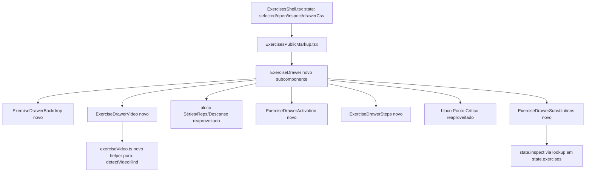

# Drawer de Detalhe do Exercício — Design

**Spec**: `.specs/features/exercise-detail-drawer/spec.md`
**Status**: Draft

---

## Architecture Overview

Nenhuma arquitetura nova é introduzida — a feature é uma reestruturação interna do drawer já existente dentro do fluxo `ExercisesShell` (estado) → `ExercisesPublicMarkup` (apresentação). O drawer, hoje um bloco monolítico de ~130 linhas dentro de `ExercisesPublicMarkup.tsx`, é quebrado em subcomponentes de apresentação pura (sem estado próprio além de UI local do player), todos recebendo `active: ExerciseRecord | null` e callbacks já existentes (`add`, `onCopyDetails`, `close`) via props — mesmo padrão de `ExerciseRow` já usado no arquivo.



---

## Code Reuse Analysis

### Existing Components to Leverage

| Component | Location | How to Use |
|---|---|---|
| `ExercisesPublicMarkup` / drawer JSX atual | `src/pages/Dashboard/markup/ExercisesPublicMarkup.tsx:314-443` | Extraído para um novo arquivo `markup/ExerciseDrawer.tsx`, mantendo os mesmos `id`s (`drawerCode`, `drawerTitle`, etc.) e classes Tailwind já compiladas em `exercises.css` — só a estrutura interna das seções muda |
| `ExercisesShellState` / `panelRef`/`open`/`close`/`inspect` | `src/pages/Dashboard/markup/ExercisesPublicMarkup.tsx:26-53`, `src/pages/Dashboard/ExercisesShell.tsx:22-111` | Reaproveitado sem mudança de contrato — o novo backdrop chama `state.close()`, e o clique num equivalente chama a mesma função de seleção que já move `selected`/`open` (`inspect`), sem precisar de uma rota/estado novo |
| `drawerCss` (posicionamento fixed + transform + transição) | `src/pages/Dashboard/ExercisesShell.tsx:9` | Já implementa o drawer como overlay `position:fixed` com slide via `transform`/`data-open` — só precisa da largura ajustada (`460px`) e de um seletor de backdrop adicional no mesmo bloco de CSS inline, sem nova lib de animação |
| Tokens visuais (`bg-brand-terracotta`, `bg-brand-olive`, `border-brand-ochre`, `bg-surface-muted`, etc.) | `src/pages/shell-assets/styles/exercises.css` | Reaproveitados 1:1 — confirmado que os hex já batem com a referência (`#e06c43` terracotta, `#7d9b68` olive). Nenhum token novo é criado |
| Ícones `material-symbols-outlined` | Já carregado globalmente (usado em `ExerciseRow`, botões do drawer) | Reaproveitado para os novos ícones (`play_arrow`, `pause`, `replay`, `fullscreen`, `sync_alt`, `chevron_right`) — já são os mesmos nomes usados na referência, fonte já disponível no projeto |
| Padrão de item clicável de lista (`ExerciseRow`) | `src/pages/Dashboard/markup/ExercisesPublicMarkup.tsx:55-120` | O item de substituição segue o mesmo padrão visual/estrutural (hover, truncamento, ícone à direita) já estabelecido por `ExerciseRow`, sem inventar um novo padrão de card |

### Integration Points

| System | Integration Method |
|---|---|
| `useExercises` (fonte de `exercises`/`ExerciseRecord[]`) | Sem mudança de contrato de busca; `equivalents` é um campo novo e OPCIONAL no tipo `ExerciseRecord` (ver Data Models) — quando a API não o retornar, o front trata como ausente (estado vazio), sem quebrar o hook existente |
| `exercise-variations` (spec irmã, `ShapeUpApi`) | Integração por CONTRATO DE TIPO, não por código: esta spec define a forma que o front espera (`ExerciseEquivalent`); quando `exercise-variations` implementar o campo/endpoint real, só o preenchimento de `equivalents` muda — nenhuma seção deste design precisa ser redesenhada |
| Navegação para "Adicionar à Ficha" (`state.add`) | Sem mudança — reaproveitado como está |

---

## Components

### `ExerciseDrawer` (orquestrador do painel)

- **Purpose**: Substitui o bloco `<aside id="exerciseDrawer">` monolítico atual, compondo os subcomponentes de seção e mantendo os `id`s/estrutura de acessibilidade já existentes (`aria-labelledby`, `inert`, Escape)
- **Location**: `src/pages/Dashboard/markup/ExerciseDrawer.tsx` (novo arquivo, extraído de `ExercisesPublicMarkup.tsx`)
- **Interfaces**:
  - `ExerciseDrawer(props: { state: ExercisesShellState }): ReactElement` — mesmo padrão de props já usado por `ExercisesPublicMarkup`
- **Dependencies**: `ExerciseDrawerBackdrop`, `ExerciseDrawerVideo`, `ExerciseDrawerActivation`, `ExerciseDrawerSteps`, `ExerciseDrawerSubstitutions`
- **Reuses**: JSX/classes do bloco atual (linhas 314-443), `drawerCss` de `ExercisesShell.tsx`

### `ExerciseDrawerBackdrop`

- **Purpose**: Camada fixa de dimming atrás do drawer, fecha ao clicar, equivalente ao `#drawerBackdrop` da referência
- **Location**: `src/pages/Dashboard/markup/ExerciseDrawer.tsx` (subcomponente local, não precisa de arquivo próprio — é pequeno)
- **Interfaces**:
  - `ExerciseDrawerBackdrop(props: { open: boolean; onClose: () => void }): ReactElement`
- **Dependencies**: nenhuma
- **Reuses**: classes utilitárias já compiladas (`bg-black/60`, `backdrop-blur-xs`, `transition-opacity`) — mesmas já vistas em outras telas do projeto (`SettingsPublicMarkup`, `NutritionDiaryShell`)

### `ExerciseDrawerVideo`

- **Purpose**: Renderiza o player de vídeo embutido com os três branches (arquivo direto / YouTube-Vimeo lite-embed / vazio), substituindo o `<a>` atual
- **Location**: `src/pages/Dashboard/markup/ExerciseDrawerVideo.tsx` (novo arquivo — componente com estado local de play/pause/slow-mo, isolado do resto do drawer)
- **Interfaces**:
  - `ExerciseDrawerVideo(props: { videoUrl?: string; title: string }): ReactElement`
  - `detectVideoKind(url?: string): 'file' | 'youtube' | 'vimeo' | 'invalid'` (helper puro exportado, testável isoladamente)
- **Dependencies**: nenhuma lib externa — `<video>`/`<iframe>` nativos, eventos nativos do elemento (`onTimeUpdate`, `onEnded`) para a barra de progresso e o timestamp
- **Reuses**: nenhum componente existente (seção nova) — reaproveita apenas tokens de cor/ícones já disponíveis

### `ExerciseDrawerActivation`

- **Purpose**: Renderiza "Ativação Primária & Sinergistas" com barras de progresso reais a partir de `muscleDetails`, substituindo o texto plano atual
- **Location**: `src/pages/Dashboard/markup/ExerciseDrawer.tsx` (subcomponente local)
- **Interfaces**:
  - `ExerciseDrawerActivation(props: { muscles: string[]; muscleDetails?: ExerciseRecord['muscleDetails'] }): ReactElement`
- **Dependencies**: nenhuma
- **Reuses**: `ExerciseRecord.muscleDetails` já existente no tipo (linha 18-23 do arquivo atual) — nenhum campo novo de dado é necessário

### `ExerciseDrawerSteps`

- **Purpose**: Renderiza "Diretrizes Técnicas de Execução" sempre numerado (com ou sem `steps` estruturado), substituindo o fallback sem numeração
- **Location**: `src/pages/Dashboard/markup/ExerciseDrawer.tsx` (subcomponente local)
- **Interfaces**:
  - `ExerciseDrawerSteps(props: { steps?: ExerciseRecord['steps']; fallbackText?: string }): ReactElement`
- **Dependencies**: nenhuma
- **Reuses**: `ExerciseRecord.steps`/`descriptionPt`/`description` já existentes

### `ExerciseDrawerSubstitutions`

- **Purpose**: Renderiza a lista real de equivalentes (ou o estado vazio), com clique navegando para o exercício equivalente
- **Location**: `src/pages/Dashboard/markup/ExerciseDrawerSubstitutions.tsx` (novo arquivo)
- **Interfaces**:
  - `ExerciseDrawerSubstitutions(props: { equivalents?: ExerciseEquivalent[]; exercises: ExerciseRecord[]; onSelect: (ex: ExerciseRecord) => void; onNotFound: () => void }): ReactElement`
- **Dependencies**: nenhuma
- **Reuses**: mesmo padrão visual de `ExerciseRow` (hover/truncamento/ícone), `state.exercises` já carregado, `state.inspect`-like handler já existente em `ExercisesShell`

---

## Data Models

### `ExerciseEquivalent` (novo tipo, contrato de apresentação apenas)

```typescript
// src/pages/Dashboard/markup/ExercisesPublicMarkup.tsx (junto de ExerciseRecord)
export type ExerciseEquivalent = {
  exerciseId: number | string; // referencia um id já presente em ExerciseRecord.id
  matchLabel?: string;         // ex.: "96% similaridade motora" — string pronta, formatação fica a cargo de quem popula (exercise-variations)
  note?: string;               // ex.: "Reduz compressão axial vertebral"
};
```

**Relationships**: `ExerciseRecord.equivalents?: ExerciseEquivalent[]` — campo OPCIONAL adicionado ao tipo já existente (linhas 5-24 do arquivo atual). `exerciseId` é resolvido contra `state.exercises` (mesma lista já carregada) para montar nome/equipamento exibidos na linha; se não encontrado, cai no branch "não encontrado" (EDD-07). O dono real do preenchimento deste campo (API, endpoint, relação simétrica) é a spec `exercise-variations` — este design não implementa a origem do dado, só o contrato de forma que o front consome.

---

## Error Handling Strategy

| Error Scenario | Handling | User Impact |
|---|---|---|
| `videoUrl` malformada ou de provedor não reconhecido | `detectVideoKind` retorna `'invalid'`; componente renderiza o mesmo estado vazio de "sem vídeo" | Usuário vê mensagem clara, nunca um player quebrado ou tela em branco |
| `equivalents` ausente/vazio (comum até `exercise-variations` existir) | Branch de estado vazio explícito, idêntico ao já existente na referência (`!subs.length`) | Usuário entende que não há substituições cadastradas, não interpreta como bug |
| Clique num equivalente cujo `exerciseId` não está em `state.exercises` | `onNotFound` dispara o toast já existente (`state.notice`), painel permanece no exercício atual | Usuário é avisado sem navegação quebrada nem painel em branco |
| Vídeo de arquivo direto falha ao carregar (404, CORS) | Evento `onError` do `<video>` cai no mesmo estado vazio de "vídeo não disponível" | Consistente com o tratamento de URL malformada — nunca um player mudo sem feedback |

---

## Risks & Concerns

| Concern | Location (file:line) | Impact | Mitigation |
|---|---|---|---|
| `ExercisesPublicMarkup.tsx` já está com ~460 linhas e vinha crescendo a cada seção nova adicionada ad-hoc | `src/pages/Dashboard/markup/ExercisesPublicMarkup.tsx:1-459` | Continuar empilhando JSX no mesmo arquivo tornaria revisão/teste visual mais difícil e aumentaria risco de regressão nas outras seções (header, lista, filtros) não relacionadas ao drawer | Extração do drawer para `ExerciseDrawer.tsx` + subcomponentes menores (ver Components) — nenhuma mudança de comportamento fora do drawer, só organização de arquivo |
| Campo `equivalents` sendo adicionado ao tipo `ExerciseRecord` compartilhado por esta spec, sem a spec `exercise-variations` ainda existir | `src/pages/Dashboard/markup/ExercisesPublicMarkup.tsx:5-24` (tipo atual) | Risco de o campo final que `exercise-variations` definir ter forma diferente da assumida aqui (`ExerciseEquivalent`), exigindo ajuste quando a spec irmã fechar | Campo documentado como contrato de APRESENTAÇÃO, isolado num tipo próprio (`ExerciseEquivalent`) fácil de ajustar; nenhuma lógica de negócio (regra de simetria, ranking) é implementada aqui, só o "shape" mínimo para renderizar uma linha de lista |
| `AD-WEB-007` exige gate de pixel-parity (screenshot antes/depois) para qualquer tela convertida nessa migração — o drawer já passou por esse gate uma vez | `.specs/STATE.md:35-41` | Reestruturar o drawer agora precisa de um novo gate de pixel-parity contra a REFERÊNCIA (não contra o estado anterior, já que a mudança é intencionalmente visual) quando a fase de Tasks/Execute rodar | Fora do escopo deste ciclo (Specify + Design apenas) — registrado aqui para a fase de Tasks configurar o gate correto (comparar contra `screen.png`/`code.html`, não contra o commit anterior) |
| Nenhum teste automatizado hoje cobre o conteúdo do drawer (`drawerCode`, `drawerAgonist` etc.) | Não localizado nenhum arquivo de teste referenciando `exerciseDrawer` durante a investigação | Reestruturação em subcomponentes sem teste de regressão prévio aumenta a chance de quebra silenciosa de algum `id`/seletor usado por E2E futuro | Fora do escopo desta spec (sem Tasks/Execute neste ciclo); registrado para a fase de Tasks incluir cobertura mínima dos novos subcomponentes (`detectVideoKind`, estado vazio de substituições) |

---

## Tech Decisions (only non-obvious ones)

| Decision | Choice | Rationale |
|---|---|---|
| Biblioteca de player de vídeo | Nenhuma — `<video>`/`<iframe>` nativos | Rung 4 do princípio de reuso (recurso nativo da plataforma cobre a necessidade): controles customizados sobre `<video>` são só HTML/CSS/eventos nativos; embeds de terceiro já vêm com seu próprio player via `<iframe>` |
| Onde vive o novo campo `equivalents` | No mesmo arquivo de tipos já existente (`ExercisesPublicMarkup.tsx`), não um arquivo de tipos novo | Seguindo o padrão já estabelecido no arquivo (todos os tipos do domínio de exercício já vivem ali) — não introduz uma nova convenção de organização de tipos |
| Extração do drawer em subcomponentes vs. manter tudo em `ExercisesPublicMarkup.tsx` | Extrair (`ExerciseDrawer.tsx`, `ExerciseDrawerVideo.tsx`, `ExerciseDrawerSubstitutions.tsx`) | O arquivo atual já mistura header, filtros, lista e drawer num único componente de 459 linhas — adicionar um player de vídeo com estado próprio (play/pause/slow-mo) sem extrair pioraria a legibilidade e o `AD-WEB-007` já estabelece o padrão de decompor telas grandes em módulos menores durante a migração |

> **Project-level decisions:** Nenhuma decisão aqui estabelece uma convenção nova de projeto além do que `AD-WEB-007` já define (decomposição incremental por tela/seção) — nada é adicionado a `.specs/STATE.md`.

---

## Dependência Registrada — `exercise-variations`

Na data desta spec (`2026-09-16`), `ShapeUpApi/.specs/features/exercise-variations/spec.md` **ainda não existe** (spec irmã em escrita paralela por outro agente). Este design assume apenas a FORMA mínima de dado necessária para renderizar a lista (`ExerciseEquivalent`, ver Data Models) e não implementa nenhuma regra de negócio (relação simétrica, ranking de similaridade, botão de troca rápida em execução de treino) — essas permanecem inteiramente no escopo de `exercise-variations`. Quando essa spec irmã fechar seu próprio contrato de API/dado, o único ajuste esperado aqui é reconciliar a forma de `ExerciseEquivalent` com o formato real retornado pelo backend — nenhuma seção de UI precisa ser redesenhada para isso.
