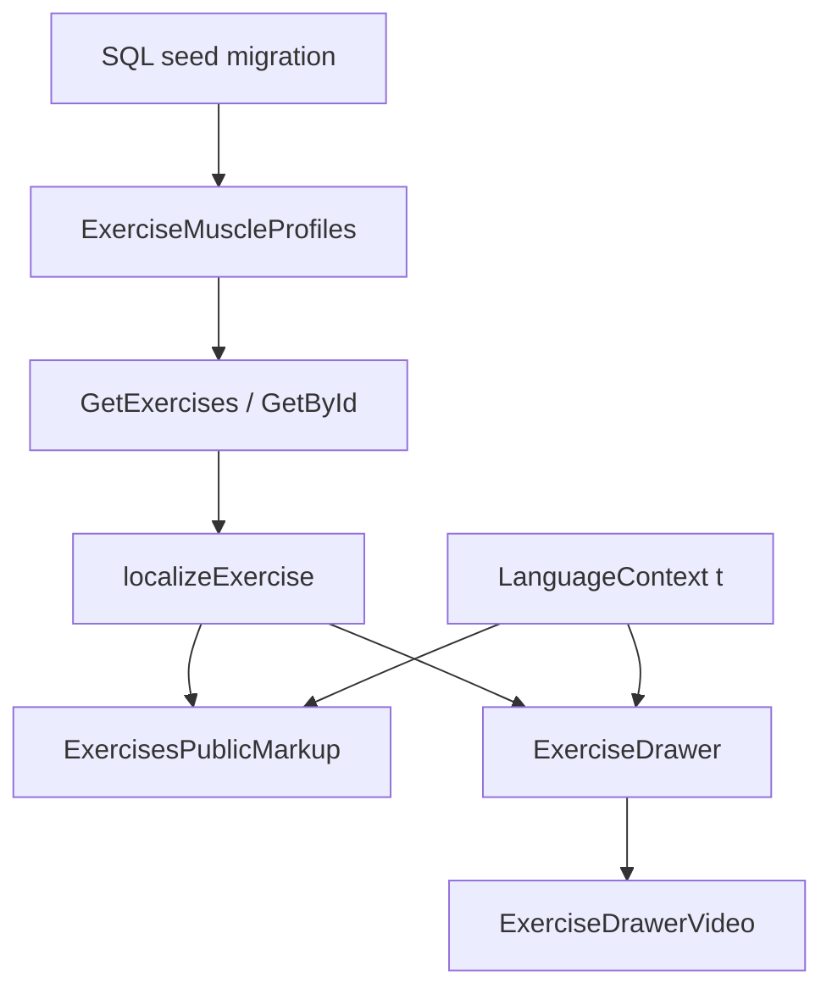

# Exercise Library Detail Polish Design

**Spec**: `.specs/features/exercise-library-detail-polish/spec.md`
**Status**: Approved (unattended; user asked to proceed without confirmation)

---

## Architecture Overview

Three seams, no new services.

API already maps `MuscleProfiles` 1:N. This cycle adds synergist rows to catalog seed and stops the UI from looking like a single-muscle product.

---

## Code Reuse Analysis

### Existing Components to Leverage

| Component | Location | How to Use |
| --------- | -------- | ---------- |
| `ExerciseDrawerVideo` | `ShapeUp-Web/src/pages/Dashboard/markup/ExerciseDrawerVideo.tsx` | Same component; swap `aspect-video` → `aspect-square` |
| `LanguageContext` | `ShapeUp-Web/src/contexts/LanguageContext.jsx` | Add `exlib.*` keys; consume via `useLanguage` |
| `localizeExercise` | `ShapeUp-Web/src/utils/exerciseCatalog.js` | Already expands muscle lists; keep |
| `CreateExerciseHandler.MapResponse` | `ShapeUpV2/.../CreateExerciseHandler.cs` | Already returns full `Muscles` array |
| Seed pattern | `ShapeUpV2/.../20260919030000_SeedExerciseMuscleProfiles.cs` | New follow-up migration, `WHERE NOT EXISTS` |

### Integration Points

| System | Integration Method |
| ------ | ------------------ |
| Training SQL | New EF migration inserting extra profiles |
| GET exercises | Unchanged JSON; more array elements |
| Web catalog hook | `useExercises` already localizes `muscles[]` |

---

## Components

### SeedExerciseCompoundMuscleProfiles

- **Purpose**: Idempotent insert of synergist `MuscleGroup` leaf flags for named catalog compounds
- **Location**: `ShapeUpV2/src/Features/Training/Infrastructure/Data/Migrations/20260919120000_SeedExerciseCompoundMuscleProfiles.cs`
- **Interfaces**: `Up`/`Down` SQL only
- **Dependencies**: `Exercises` seeded at `2026-09-18T04:00:00Z`
- **Reuses**: `WHERE NOT EXISTS` from prior muscle seed

### CreateExercise multi-muscle coverage

- **Purpose**: Prove persist+map of 2+ profiles
- **Location**: `ShapeUpV2/tests/UnitTests/Domains/Training/Exercises/CreateExerciseHandlerTests.cs`
- **Interfaces**: existing handler
- **Dependencies**: mocks already in file
- **Reuses**: `NewSut`

### ExerciseDrawerVideo slot

- **Purpose**: Square media slot for empty and playing states
- **Location**: `ShapeUp-Web/src/pages/Dashboard/markup/ExerciseDrawerVideo.tsx`
- **Interfaces**: same props; empty copy via `t` after i18n task
- **Dependencies**: `detectVideoKind`
- **Reuses**: existing branching

### Exercise library i18n

- **Purpose**: Replace PT literals
- **Location**: `LanguageContext.jsx` then drawer/markup/shell
- **Interfaces**: `t('exlib.*')`
- **Dependencies**: `LanguageProvider`
- **Reuses**: `wevI18nKeys.test.jsx` probe pattern

### Drawer activation

- **Purpose**: Agonist = max activation; synergists = rest joined
- **Location**: `ExerciseDrawer.tsx` `ExerciseDrawerActivation`
- **Dependencies**: `muscleDetails` / `muscles`
- **Reuses**: existing bars

---

## Data Models (if applicable)

No schema change. `ExerciseMuscleProfile` stays `(ExerciseId, MuscleGroup, ActivationPercent)`.

Seed compounds (minimum extra rows; percents illustrative, not claimed as EMG science):

| Exercise | Existing typical | Add |
| -------- | ---------------- | --- |
| Barbell Bench Press | Chest composite `7` | Split/add `MiddleChest`, `Triceps`, `DeltoidAnterior` if missing as leaves |
| Barbell Back Squat | Quad + Glute | keep; ensure ≥2 |
| Barbell Row | Lats + MiddleBack | keep; ensure ≥2 |
| Pull-Up / Lat Pulldown | Lats only | Biceps |
| Barbell Overhead Press | Shoulders composite | Triceps leaf |
| Barbell Romanian Deadlift | Ham + Glute | keep |
| Barbell Hip Thrust | Glute | Hamstrings |
| Close-Grip Bench Press | Triceps | MiddleChest |

Prefer **leaf** flags (`1<<n`) over composites so `GetMuscleName` is not `"Chest"` hiding three regions.

**Relationships**: Exercise 1—N MuscleProfile (unique pair).

---

## Error Handling Strategy

| Error Scenario | Handling | User Impact |
| -------------- | -------- | ----------- |
| Missing video | Square placeholder + translated copy | Layout holds |
| GET muscles length 1 | Synergist `—` | Honest empty |
| Duplicate muscle on create | Unique index | Existing 400/500; no new handler |
| Missing i18n key | `t()` returns key | No crash |

---

## Risks & Concerns

| Concern | Location (file:line) | Impact | Mitigation |
| ------- | -------------------- | ------ | ---------- |
| Dirty ShapeUp-Web tree | git status | Unrelated files in commit | Stage only ELP paths |
| Composite flags already in seed | `20260919030000` | One row still looks like one muscle in API names | New rows are leaves; UI uses array length |
| Tests assert PT copy | `ExercisesShell.test.jsx` | Break when i18n defaults to en in tests | Tests set `shapeup_language` to `pt-BR` already; keep |
| `aspect-square` vs old `aspect-video` tests | `ExerciseDrawerVideo.test.jsx` | Fail until updated | Same task as CSS change |

---

## Tech Decisions (only non-obvious ones)

| Decision | Choice | Rationale |
| -------- | ------ | --------- |
| New migration vs edit old seed | New timestamped migration | Old seed may already be applied |
| Square for both empty and video | Same `aspect-square` | Layout does not jump when inspecting next exercise |
| Key prefix | `exlib.` | Isolated from `pro.exercises.*` used by legacy `Exercises.jsx` |
| Cross-repo | Two git repos, two pushes | API seed cannot live in the web repo |

No new `AD-WEB-*`: feature-local.
