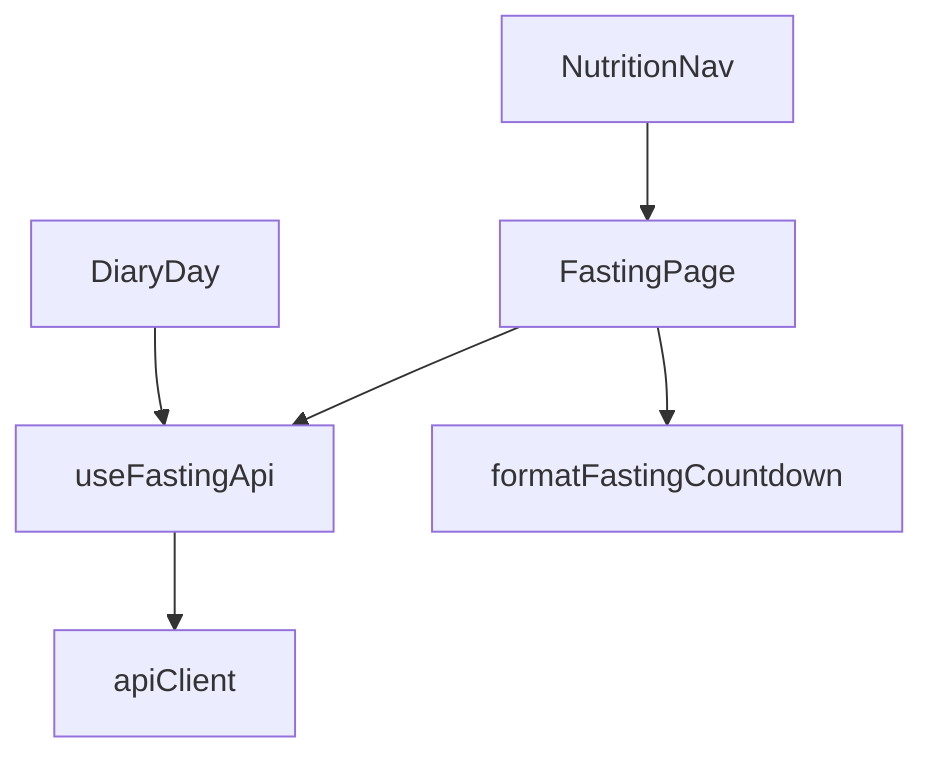

# Intermittent Fasting Timer (Web) Design

**Spec**: `.specs/features/intermittent-fasting-timer/spec.md`
**Status**: Approved for Execute (user: integration OK, build the Jejum screen)
**API**: ShapeUpV2 `/api/nutrition/fasting*` (JSON camelCase)

---

## Architecture Overview

Reuse the nutrition workspace. Add route `fasting` under `NutritionWorkspaceShell`. `NutritionNav` grows a fifth tab whose link is omitted when the first GET of `/api/nutrition/fasting` returns 404 with `code === nutrition.fasting.disabled`.

`FastingPage` owns GET snapshot, PUT agenda, POST start/end-early/cancel, GET history. Countdown is `boundaryAt - Date.now()` formatted `hh:mm:ss` (hours zero-padded). Interval 1s while visible; `document.visibilitychange` recomputes; remaining ≤ 0 refetches GET (no local state machine).

---

## Code Reuse Analysis

| Component | Location | How to Use |
| --- | --- | --- |
| `NutritionNav` / `NutritionWorkspaceShell` / `App.jsx` nutrition nested routes | existing | Fifth tab + `fasting` child route |
| `useNutritionApi` / `apiClient` | hooks/services | New `useFastingApi`; parse `{ code, message }` on failed JSON |
| `GoalOnboarding` page chrome | Nutrition.css + Input/Button/Skeleton | Same masthead / journal-sheet / error text |
| `appSurface.js` | i18n | `nutrition.nav.fasting` + fasting strings en/pt/es |
| `Layout` | already `startsWith('/dashboard/nutrition')` | No layout fork; add fasting path to Layout.nutrition test |
| `durationDistance.formatDurationSeconds` | mm:ss not `00:mm:ss` | New `formatFastingCountdown` that always emits `hh:mm:ss` |

---

## Components

### formatFastingCountdown

- **Purpose**: Floor remaining seconds from `boundaryAt` ISO/Date vs `now`; clamp at 0; always `hh:mm:ss`.
- **Location**: `src/utils/fastingCountdown.js`

### apiClient error body

- **Purpose**: On `!ok`, parse JSON `{ code, message }` into `error.code` / `error.message` when present.
- **Location**: `src/services/apiClient.js` (existing)

### useFastingApi

- **Purpose**: `getClock`, `putAgenda`, `startOverride`, `endOverrideEarly`, `cancelOverride`, `getHistory`.
- **Location**: `src/hooks/api/useFastingApi.js`
- Endpoints match FastingController: GET `/api/nutrition/fasting`, PUT `.../agenda`, POST `.../override/start|end-early|cancel`, GET `.../history`.

### FastingPage

- **Purpose**: Disclaimer, protocol radios, 30-min eating start `<select>`, Save, countdown, Start / End early / Cancel, history list.
- **Location**: `src/pages/Dashboard/Nutrition/FastingPage.jsx`
- `data-testid`: `fasting-page`, `fasting-countdown`, `fasting-save`, `fasting-start`, `fasting-end-early`, `fasting-cancel`, `fasting-disclaimer`, `fasting-error`, `fasting-empty`, `fasting-history`.

### NutritionNav flag

- **Purpose**: Fetch GET clock once per shell mount; hide Jejum link on 404 `nutrition.fasting.disabled`.
- **Location**: `NutritionNav.jsx` (or tiny `useFastingFeature` in the same folder)

---

## Data Models (client)

Snapshot matches API: `agenda`, `override`, `recommendation`, `clock: { status, boundaryAt, source }`.

PUT body: `{ protocol, eatingStartMinutes, timeZone, fastHours? }` — `timeZone` from `Intl.DateTimeFormat().resolvedOptions().timeZone`. Custom: `protocol: 'custom'` + `fastHours`.

---

## Error Handling Strategy

| Scenario | Handling |
| --- | --- |
| GET 404 disabled | Hide tab; FastingPage not shown (redirect diary if URL hit) |
| GET 500 / network | `fasting-error` with `err.message`; do not invent snapshot |
| PUT/POST 400/409 | Show `err.message`; keep last GET |
| Client validation | Named field before PUT (protocol, eating start, custom hours) |

---

## Risks & Concerns

| Concern | Mitigation |
| --- | --- |
| CachedOutlet keeps hidden FastingPage ticking | Pause interval when `document.hidden` or pathname not fasting |
| apiClient GET cache of 404 | Do not cache failed GETs (already only caches success) |
| Shadow DOM tests | Same NutritionWorkspaceShell pattern |

---

## Tech Decisions

| Decision | Choice | Rationale |
| --- | --- | --- |
| Flag discovery | GET clock 404 code | No public flag read for athletes |
| Tick | client interval + refetch at 0 | API has no websocket |
| Diary warning | GET clock on add-entry, banner only | Spec: no cancel POST |
